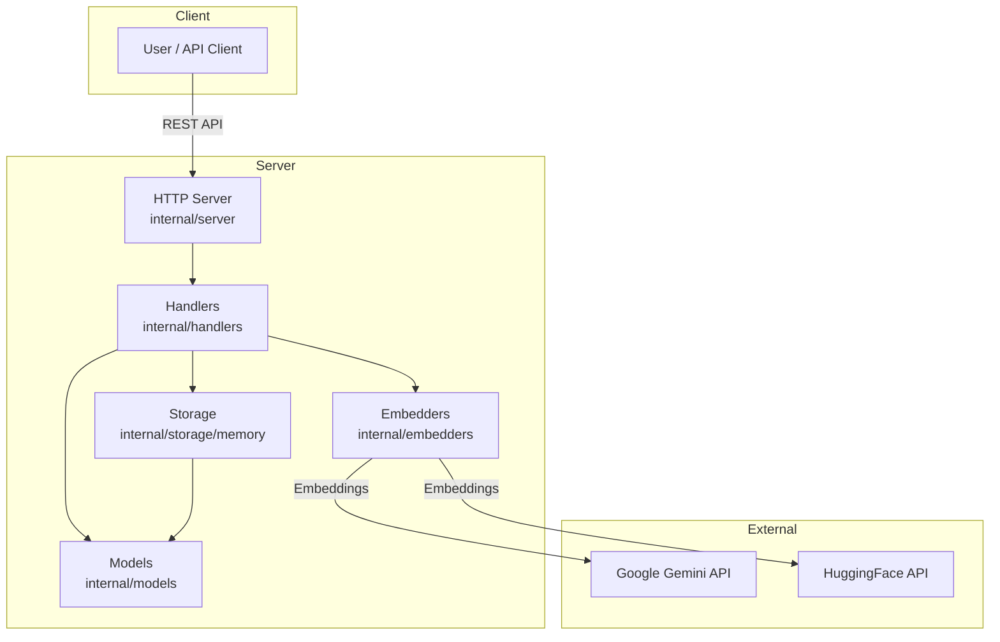

# Same-Same Vector Database Microservice


[](https://golang.org)
[](LICENSE)
[](https://github.com/tahcohcat/same-same/actions)
[](https://github.com/tahcohcat/same-same/actions)
[](https://hub.docker.com/r/tahcoh/same-same)
[](https://github.com/tahcohcat/same-same)
[](https://github.com/tahcohcat/same-same)
---
[](https://ai.google.dev/gemini-api/docs/embeddings)
[](https://huggingface.co/)
[](https://nginx.org/)
[](https://huggingface.co/)
[](https://prometheus.io/)
[](https://grafana.com/)

A lightweight RESTful microservice for storing and searching vectors using cosine similarity, with built-in embedding generation for quotes.

## Features

- In-memory vector storage with thread safety
- RESTful API for CRUD operations
- Vector similarity search using cosine similarity
- Automatic embedding generation using Google Gemini API
- Quote-specific endpoints for easy text vectorization
- Metadata filtering and search
- Pluggable embedder interface (Gemini, HuggingFace support)
- JSON API responses

## Usage

* 🚀 [Quick Start Guide](QUICKSTART.md)
* 🔑 [General Usage Documentation](USAGE.md)

## API Endpoints

### Vectors
 - `POST /api/v1/vectors/embed` - Create vector from quote text (auto-generates embedding)
 - `GET /api/v1/vectors/count` - Get total number of vectors in database
 - `POST /api/v1/vectors` - Create a new vector manually
 - `GET /api/v1/vectors` - List all vectors
 - `GET /api/v1/vectors/{id}` - Get a specific vector
 - `PUT /api/v1/vectors/{id}` - Update a vector
 - `DELETE /api/v1/vectors/{id}` - Delete a vector
 - `POST /api/v1/vectors/search` - Search vectors by similarity
 - `POST /api/v1/search` - Search vectors by text (auto-embedding and similarity search)

### Health
- `GET /health` - Health check endpoint

### Architecture

The diagram illustrates the core components and data flow of the Same-Same Vector Database Microservice:

 * **Client**: Users or API clients interact with the system via REST API calls.
 * **Server**: The HTTP server receives requests and delegates them to handlers, which coordinate embedding generation, vector storage, and data modeling.
   * **Handlers** process API requests and orchestrate operations.
   * **Embedders** generate vector embeddings using external services (Google Gemini or HuggingFace).
   * **Storage** manages vectors in memory for fast access and similarity search.
   * **Models** define the data structures used throughout the system.
 * **External Services**: Embedding providers (Google Gemini, HuggingFace) are called to transform text into high-dimensional vectors.
This modular design enables easy extension, integration of new embedders, and rapid semantic search capabilities.




## Setup

### Environment Variables
```bash
export GEMINI_API_KEY=your_google_gemini_api_key_here
```

### Start the server
```bash
go run ./cmd/same-same -addr :8080
```

## Usage

### Create vector from quote (automatic embedding)
```bash
curl -X POST http://localhost:8080/api/v1/vectors/embed \
  -H "Content-Type: application/json" \
  -d '{
    "text": "The only way to do great work is to love what you do.",
    "author": "Steve Jobs"
  }'
```

### Search similar quotes
```bash
# Search similar quotes by text (auto-embedding)
curl -X POST http://localhost:8080/api/v1/search \
  -H "Content-Type: application/json" \
  -d '{
    "text": "Follow your passion in work",
    "namespace": "quote",
    "limit": 5,
    "return_embedding": false
  }'
```

**Description:**
`POST /api/v1/search` takes a text query, automatically generates an embedding, and returns the most similar vectors. You can specify `namespace` to filter by type (e.g., `quote`), set `limit` for number of results, and `return_embedding` to include/exclude embeddings in the response.

### Create vector manually
```bash
curl -X POST http://localhost:8080/api/v1/vectors \
  -H "Content-Type: application/json" \
  -d '{
    "id": "custom1",
    "embedding": [0.1, 0.2, 0.3, 0.4],
    "metadata": {"type": "custom", "category": "tech"}
  }'
```

### Get vector count
```bash
curl http://localhost:8080/api/v1/vectors/count
```

### Get all vectors
```bash
curl http://localhost:8080/api/v1/vectors
```

## Architecture

### Embedder Interface
The system uses a pluggable embedder interface, making it easy to swap between different embedding providers:

```go
type Embedder interface {
    Embed(text string) ([]float64, error)
}
```

**Supported Embedders:**
- **Google Gemini** (default): `internal/embedders/quotes/gemini`
- **HuggingFace**: `internal/embedders/quotes/huggingface`

### Project Structure
```
internal/
├── embedders/           # Embedding interfaces and implementations
│   ├── embedder.go     # Main interface
│   └── quotes/
│       ├── gemini/     # Google Gemini implementation
│       └── huggingface/# HuggingFace implementation
├── handlers/           # HTTP request handlers
├── models/             # Data structures (Vector, Quote)
├── server/             # HTTP server setup
└── storage/            # In-memory vector storage
```

## Development

### Build the project
```bash
go build ./cmd/same-same
```

### Run tests
```bash
go test ./...
```

### Test embedders individually
```bash
# Test Gemini embedder
export GEMINI_API_KEY=your_key
go run ./cmd/test-gemini

# Test HuggingFace embedder  
export HUGGINGFACE_API_KEY=your_key
go run ./cmd/test-embedder
```

### Adding New Embedders
1. Implement the `embedders.Embedder` interface
2. Add your implementation to `internal/embedders/quotes/`
3. Update the server initialization in `internal/server/server.go`

---
### Contributing

We welcome contributions - Please see [CONTRIBUTING.md](CONTRIBUTING.md)
 for details.