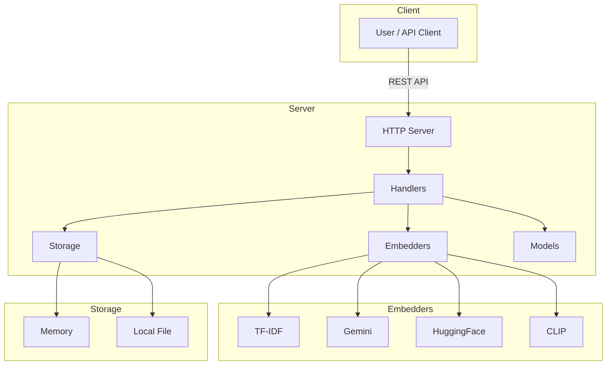

# Same-Same Vector Database Microservice

[](https://golang.org)
[](LICENSE)
[](https://github.com/tahcohcat/same-same/actions)
[](https://github.com/tahcohcat/same-same/actions)
[](https://hub.docker.com/r/tahcoh/same-same)
[](https://github.com/tahcohcat/same-same)
[](https://github.com/tahcohcat/same-same)

---

[](https://ai.google.dev/gemini-api/docs/embeddings)
[](https://huggingface.co/)
[](https://nginx.org/)
[](https://docker.com/)
[](https://prometheus.io/)
[](https://grafana.com/)

A lightweight RESTful microservice for storing and searching vectors using cosine similarity, with **multimodal embedding support** for both text and images.

Designed and optimized for quick prototyping and exploration of the vector space with minimal setup requirements.

## ✨ Features

### 🗄️ Storage Options
- **In-memory vector storage** with thread safety (default)
- **[Local file system storage](LOCAL_FILE_STORAGE.md)** with schema-driven persistence, metadata indexing, and multimodal support

### 🎨 Multimodal Embedding Support
- **CLIP** - Embed images and text into the same vector space for cross-modal search (Pure Go, no Python!)
- **Text Embedders**: 
  - Local TF-IDF (default, no external dependencies)
  - Google Gemini API
  - HuggingFace API
- **Search images with text queries** and vice versa

### 🚀 Core Features
- RESTful API for CRUD operations
- Vector similarity search using cosine similarity
- Advanced [metadata filtering and search](ADVANCED_SEARCH_USAGE.md)
- Flexible data ingestion from multiple sources
- Pluggable embedder interface
- JSON API responses

## 📚 Documentation

 * 🔑 [General Usage Documentation](USAGE.md)
 * 📥 [Data Ingestion Guide](INGESTION_GUIDE.md)
 * 🖼️ [Image Embedding with CLIP](IMAGE_EMBEDDING_GUIDE.md)
 * 🏗️ [Cobra CLI Migration Guide](COBRA_MIGRATION.md)
 * 📖 [OpenAPI Specification](USAGE.md#openapi-specification)

## 🚀 Quick Start

### Installation

```bash
# Clone the repository
git clone https://github.com/tahcohcat/same-same.git
cd same-same

# Build the CLI
go build ./cmd/same-same
```

### Start the Server

```bash
# Start server on default port 8080
same-same serve

# Or with custom port
same-same serve -a :9000

# With debug logging
same-same serve -d
```

### Ingest Data

```bash
# Ingest built-in demo dataset
same-same ingest demo

# Ingest with namespace
same-same ingest -n quotes demo

# Ingest CSV file
same-same ingest --text-col description data.csv

# Ingest images (Pure Go CLIP - no Python!)
same-same ingest -e clip images:./photos

# Ingest HuggingFace dataset
same-same ingest hf:imdb --split train --sample 1000
```

### Search

```bash
# Search by text
curl -X POST http://localhost:8080/api/v1/search \
  -H "Content-Type: application/json" \
  -d '{"text": "machine learning", "limit": 5}'

# Search images with text (after ingesting images)
curl -X POST http://localhost:8080/api/v1/search \
  -H "Content-Type: application/json" \
  -d '{"text": "sunset over ocean", "limit": 10}'
```

## 💡 CLI Commands

Same-Same provides a unified CLI powered by [Cobra](https://github.com/spf13/cobra):

### Available Commands

```bash
same-same --help              # Show all commands
same-same serve [flags]       # Start the server
same-same ingest <source>     # Ingest data from various sources
```

### Common Usage Examples

```bash
# Start server
same-same serve                           # Default port 8080
same-same serve -a :9000 -d              # Custom port with debug

# Ingest text data
same-same ingest demo                     # Built-in dataset
same-same ingest -n quotes -v demo       # With namespace and verbose
same-same ingest data.csv                # CSV file
same-same ingest data.jsonl              # JSONL file
same-same ingest hf:imdb                 # HuggingFace dataset

# Ingest images (no Python required!)
same-same ingest -e clip images:./photos           # Image directory
same-same ingest -e clip image-list:images.txt    # Image list file
same-same ingest -e clip -n vacation images:./trip # With namespace
```

### Global Flags

- `-v, --verbose` - Verbose output
- `-n, --namespace <string>` - Namespace for vectors (default: "default")
- `--dry-run` - Perform dry run without making changes
- `--version` - Show version

## 🎯 Image Embedding (Pure Go!)

Same-Same supports **multimodal embeddings** using CLIP - embed both images and text into the same vector space.

**✅ No Python Required!** The default CLIP embedder is pure Go with zero external dependencies.

```bash
# Ingest images - works out of the box!
same-same ingest -e clip images:./photos

# Search images with text
curl -X POST http://localhost:8080/api/v1/search \
  -H "Content-Type: application/json" \
  -d '{"text": "beach sunset", "limit": 5}'
```

**Optional:** Use Python-based OpenCLIP for higher accuracy:
```bash
# Install Python dependencies
pip install open_clip_torch pillow torch

# Use Python CLIP
export CLIP_USE_PYTHON=true
same-same ingest -e clip --clip-model ViT-L-14 images:./photos
```

See [IMAGE_EMBEDDING_GUIDE.md](IMAGE_EMBEDDING_GUIDE.md) for detailed documentation.

## 📊 Data Ingestion Sources

### Built-in Datasets
```bash
same-same ingest demo              # 20 quotes (quick test)
same-same ingest quotes            # Full quotes dataset
same-same ingest quotes-small      # Same as demo
```

### HuggingFace Datasets
```bash
same-same ingest hf:imdb                           # IMDB reviews
same-same ingest hf:squad:v2 --split train        # SQuAD v2
same-same ingest hf:ag_news --sample 1000         # AG News (sampled)
```

### CSV Files
```bash
same-same ingest data.csv                          # Default "text" column
same-same ingest --text-col content data.csv      # Custom column
same-same ingest -n products products.csv         # With namespace
```

### JSONL Files
```bash
same-same ingest data.jsonl                        # JSON lines
same-same ingest -v data.ndjson                   # With verbose output
```

### Images
```bash
same-same ingest -e clip images:./photos          # Directory (recursive)
same-same ingest -e clip -r=false images:./dir    # Non-recursive
same-same ingest -e clip image-list:list.txt      # From list file
```

Supported formats: JPEG, PNG, GIF, BMP, WebP

## 🔌 API Endpoints

### Vectors
- `POST /api/v1/vectors/embed` - Create vector from text (auto-generates embedding)
- `GET /api/v1/vectors/count` - Get total number of vectors
- `POST /api/v1/vectors` - Create vector manually
- `GET /api/v1/vectors` - List all vectors
- `GET /api/v1/vectors/{id}` - Get specific vector
- `PUT /api/v1/vectors/{id}` - Update vector
- `DELETE /api/v1/vectors/{id}` - Delete vector
- `POST /api/v1/vectors/search` - Search by vector similarity
- `POST /api/v1/search` - Search by text (auto-embedding)

### Health
- `GET /health` - Health check endpoint

### Example API Usage

```bash
# Create vector from text
curl -X POST http://localhost:8080/api/v1/vectors/embed \
  -H "Content-Type: application/json" \
  -d '{"text": "artificial intelligence", "author": "AI"}'

# Search similar vectors
curl -X POST http://localhost:8080/api/v1/search \
  -H "Content-Type: application/json" \
  -d '{
    "text": "machine learning",
    "limit": 5,
    "namespace": "quotes"
  }'

# Get vector count
curl http://localhost:8080/api/v1/vectors/count

# Manual vector creation
curl -X POST http://localhost:8080/api/v1/vectors \
  -H "Content-Type: application/json" \
  -d '{
    "id": "custom1",
    "embedding": [0.1, 0.2, 0.3, ...],
    "metadata": {"type": "custom"}
  }'
```

## 🏗️ Architecture

### System Architecture



### Project Structure

```
same-same/
├── cmd/
│   └── same-same/              # Main CLI application
│       ├── main.go            # Entry point
│       └── cmd/               # Cobra commands
│           ├── root.go        # Root command
│           ├── serve.go       # Server command
│           └── ingest.go      # Ingest command
├── internal/
│   ├── embedders/             # Embedding implementations
│   │   ├── embedder.go       # Base interface
│   │   ├── multimodal.go     # Multimodal interfaces
│   │   ├── clip/             # CLIP embedders
│   │   │   ├── simple.go     # Pure Go CLIP (default)
│   │   │   ├── clip.go       # Python OpenCLIP (optional)
│   │   │   └── native.go     # Advanced Go CLIP
│   │   └── quotes/           # Text embedders
│   │       ├── gemini/       # Google Gemini
│   │       ├── huggingface/  # HuggingFace
│   │       └── local/tfidf/  # Local TF-IDF
│   ├── handlers/             # HTTP handlers
│   ├── ingestion/            # Data ingestion
│   │   ├── source.go         # Source interface
│   │   ├── builtin.go        # Built-in datasets
│   │   ├── file.go           # CSV/JSONL
│   │   ├── image.go          # Image sources
│   │   ├── huggingface.go    # HuggingFace
│   │   └── ingestor.go       # Main ingestion logic
│   ├── models/               # Data models
│   ├── server/               # HTTP server
│   └── storage/              # Storage implementations
│       ├── memory/           # In-memory
│       └── local/            # File-based
├── .examples/                # Example data and scripts
│   ├── data/                 # Sample datasets
│   ├── images/               # Sample images
│   └── test_clip.py          # CLIP installation test
└── docs/                     # Documentation
```

### Embedder Interface

The system uses a pluggable embedder interface:

```go
// Text embedder
type Embedder interface {
    Embed(text string) ([]float64, error)
    Name() string
}

// Image embedder
type ImageEmbedder interface {
    EmbedImage(imagePath string) ([]float64, error)
    EmbedImageBytes(imageData []byte) ([]float64, error)
    Name() string
}

// Multimodal embedder (text + images)
type MultiModalEmbedder interface {
    Embedder
    ImageEmbedder
    Dimensions() int
}
```

**Supported Embedders:**
- **TF-IDF** (local, no dependencies) - Text only
- **Gemini** (Google API) - Text only
- **HuggingFace** (API) - Text only
- **CLIP** (Pure Go or Python) - Text + Images

## 🛠️ Environment Variables

```bash
# Embedder selection (optional, defaults to local)
export EMBEDDER_TYPE=local        # Options: local, gemini, huggingface, clip

# API keys (if using external embedders)
export GEMINI_API_KEY=your_key
export HUGGINGFACE_API_KEY=your_key

# CLIP mode (optional, defaults to Pure Go)
export CLIP_USE_PYTHON=true       # Use Python OpenCLIP for higher accuracy
```

## 🔬 Development

### Build

```bash
go build ./cmd/same-same
```

### Run Tests

```bash
go test ./...
```

### Test Embedders

```bash
# Test TF-IDF (default)
same-same ingest -v demo

# Test CLIP (Pure Go)
same-same ingest -e clip -v images:.examples/images

# Test CLIP (Python - requires installation)
export CLIP_USE_PYTHON=true
same-same ingest -e clip -v images:.examples/images

# Test Gemini
export GEMINI_API_KEY=your_key
export EMBEDDER_TYPE=gemini
same-same ingest -v demo
```

### Adding New Embedders

1. Implement the `embedders.Embedder` interface (or `MultiModalEmbedder`)
2. Add your implementation to `internal/embedders/`
3. Update `cmd/same-same/cmd/ingest.go` to include your embedder

Example:

```go
package myembedder

import "github.com/tahcohcat/same-same/internal/embedders"

type MyEmbedder struct {
    // fields
}

func NewMyEmbedder() embedders.Embedder {
    return &MyEmbedder{}
}

func (m *MyEmbedder) Embed(text string) ([]float64, error) {
    // implementation
}

func (m *MyEmbedder) Name() string {
    return "my-embedder"
}
```

## 🐳 Docker

```bash
# Build image
docker build -t same-same .

# Run container
docker run -d \
  --name same-same \
  -p 8080:8080 \
  -e EMBEDDER_TYPE=local \
  same-same

# With Gemini embedder
docker run -d \
  --name same-same \
  -p 8080:8080 \
  -e EMBEDDER_TYPE=gemini \
  -e GEMINI_API_KEY=your_key \
  same-same
```

## 📈 Performance

### Ingestion Speed

| Source | Embedder | Speed | Notes |
|--------|----------|-------|-------|
| Built-in | TF-IDF | ~39k records/sec | Pure Go |
| CSV | TF-IDF | ~10k records/sec | Depends on file I/O |
| Images | CLIP (Go) | ~1k images/sec | Pure Go, no Python |
| Images | CLIP (Python) | ~50-100 images/sec | Higher accuracy |
| HuggingFace | TF-IDF | Varies | Network dependent |

### Storage Options

| Type | Speed | Persistence | Use Case |
|------|-------|-------------|----------|
| Memory | Fastest | No | Development, testing |
| Local File | Fast | Yes | Production, single instance |

## 🤝 Contributing

We welcome contributions! Please see [CONTRIBUTING.md](CONTRIBUTING.md) for details.

### Development Workflow

1. Fork the repository
2. Create a feature branch
3. Make your changes
4. Run tests: `go test ./...`
5. Submit a pull request

## 📄 License

This project is licensed under the MIT License - see the [LICENSE](LICENSE) file for details.

## 🙏 Acknowledgments

- [OpenCLIP](https://github.com/mlfoundations/open_clip) for CLIP model inspiration
- [Cobra](https://github.com/spf13/cobra) for CLI framework
- [Google Gemini](https://ai.google.dev/gemini-api/docs/embeddings) for embeddings API
- [HuggingFace](https://huggingface.co/) for dataset and embeddings access

## 📞 Support

- 📖 Documentation: [View all guides](/)
- 🐛 Issues: [GitHub Issues](https://github.com/tahcohcat/same-same/issues)
- 💬 Discussions: [GitHub Discussions](https://github.com/tahcohcat/same-same/discussions)

---

**Made with ❤️ for the vector search community**
