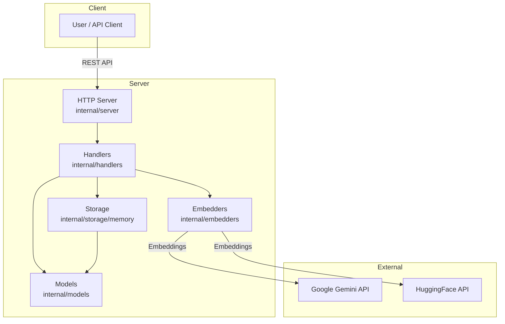

# Same-Same Vector Database Microservice


[](https://golang.org)
[](LICENSE)
[](https://github.com/tahcohcat/same-same/actions)
[](https://github.com/tahcohcat/same-same/actions)
[](https://hub.docker.com/r/tahcoh/same-same)
[](https://github.com/tahcohcat/same-same)
[](https://github.com/tahcohcat/same-same)
---
[](https://ai.google.dev/gemini-api/docs/embeddings)
[](https://huggingface.co/)
[](https://nginx.org/)
[](https://huggingface.co/)
[](https://prometheus.io/)
[](https://grafana.com/)

A lightweight RESTful microservice for storing and searching vectors using cosine similarity, with built-in embedding generation for text.

Designed and optimised for quick prototyping and exploration of the vector space with the minimal necessary setup requirements.

## Features
- **Dual Storage Options**
  - In-memory vector storage with thread safety (default)
  - [Local file system storage](LOCAL_FILE_STORAGE.md) with schema-driven persistence, metadata indexing, and multimodal support
- RESTful API for CRUD operations
- Vector similarity search using cosine similarity
- Automatic embedding generation using:
  - Local TF-IDF embedder (default, no external dependencies)
  - Google Gemini API
  - HuggingFace API
- Quote-specific endpoints for easy text vectorization
- Advanced [metadata filtering and search](ADVANCED_SEARCH_USAGE.md)
- Pluggable embedder interface (local TF-IDF, Gemini, HuggingFace)
- JSON API responses


## Getting Started 

This section will help you get up and running with the Same-Same Vector DB running on localhost:8080. By default, the system uses a local TF-IDF embedder, which requires no external API keys or dependencies. You can also use Google Gemini or HuggingFace by setting the EMBEDDER_TYPE environment variable.

> **Quick Start with Ingestion:** For a faster way to load data, see the [Data Ingestion Guide](INGESTION_GUIDE.md) which provides a CLI tool to import data from built-in datasets, HuggingFace, CSV, and JSONL files.

### Step 1: Start the Vector Database

### Set your API key
```bash
export GEMINI_API_KEY=your_google_gemini_api_key_here
```

### Start the service
```bash
go run ./cmd/same-same -addr :8080

# or with docker
docker run -d --name same-same -p 8080:8080 -e GEMINI_API_KEY=your_key same-same:latest
```

## Step 2: Launch the Demo Application

We include a **sample dataset** of public-domain quotes, so you can try out same-same immediately:

- **File path:** `.examples/data/quotes.txt` 

### Load the quotes into the index

```bash
 cat .examples/data/quotes_small.txt | tr -d '\r' | while IFS= read -r line; do   quote=$(printf '%s' "$line" | sed 's/ — .*//; s/\\/\\\\/g; s/"/\\"/g');   author=$(printf '%s' "$line" | sed 's/.* — //; s/\\/\\\\/g; s/"/\\"/g');\
    curl -s -X POST "http://localhost:8081/api/v1/vectors/embed" -H "Content-Type: application/json" -d "{\"text\":\"$quote\", \"author\":\"$author\"}"; done
```

### Run a similarity search
```bash
curl -s "http://localhost:8081/api/v1/search" \
  -H "Content-Type: application/json" \
  -d '{"text": "patience", "limit": 2, "namespace": "quotes"}'
```

### Example response:
```json
{
  "matches": [
    {
      "vector": {
        "id": "quote_1759143813",
        "metadata": {
          "author": "Aristotle",
          "text": "Wishing to be friends is quick work, but friendship is a slow ripening fruit.",
          "type": "quote"
        },
        "created_at": "0001-01-01T00:00:00Z",
        "updated_at": "2025-09-29T12:03:33.9520825+01:00"
      },
      "score": 0.5861640990760936
    },
    {
      "vector": {
        "id": "quote_1759143810",
        "metadata": {
          "author": "Plato",
          "text": "Opinion is the medium between knowledge and ignorance.",
          "type": "quote"
        },
        "created_at": "0001-01-01T00:00:00Z",
        "updated_at": "2025-09-29T12:03:30.8416675+01:00"
      },
      "score": 0.5502264895305855
    },
  ]
}
```

For more ideas and other usage documentation see the guides:
 * 🔑 [General Usage Documentation](USAGE.md)
 * 📥 [Data Ingestion Guide](INGESTION_GUIDE.md)
 * 📖 [OpenAPI Specification Section](USAGE.md#openapi-specification)

## API Endpoints

### Vectors
 - `POST /api/v1/vectors/embed` - Create vector from quote text (auto-generates embedding)
 - `GET /api/v1/vectors/count` - Get total number of vectors in database
 - `POST /api/v1/vectors` - Create a new vector manually
 - `GET /api/v1/vectors` - List all vectors
 - `GET /api/v1/vectors/{id}` - Get a specific vector
 - `PUT /api/v1/vectors/{id}` - Update a vector
 - `DELETE /api/v1/vectors/{id}` - Delete a vector
 - `POST /api/v1/vectors/search` - Search vectors by similarity
 - `POST /api/v1/search` - Search vectors by text (auto-embedding and similarity search)

### Health
- `GET /health` - Health check endpoint

### Architecture

The diagram illustrates the core components and data flow of the Same-Same Vector Database Microservice:

 * **Client**: Users or API clients interact with the system via REST API calls.
 * **Server**: The HTTP server receives requests and delegates them to handlers, which coordinate embedding generation, vector storage, and data modeling.
   * **Handlers** process API requests and orchestrate operations.
   * **Embedders** generate vector embeddings using external services (Google Gemini or HuggingFace).
   * **Storage** manages vectors in memory for fast access and similarity search.
   * **Models** define the data structures used throughout the system.
 * **External Services**: Embedding providers (Google Gemini, HuggingFace) are called to transform text into high-dimensional vectors.
This modular design enables easy extension, integration of new embedders, and rapid semantic search capabilities.




## Setup


### Environment Variables
You can select the embedder using the `EMBEDDER_TYPE` environment variable:

```bash
# Options: local (default), gemini, huggingface
export EMBEDDER_TYPE=local

# If using Gemini:
export GEMINI_API_KEY=your_google_gemini_api_key_here

# If using HuggingFace:
export HUGGINGFACE_API_KEY=your_huggingface_api_key_here
```

### Start the server
```bash
go run ./cmd/same-same -addr :8080
```

## Usage

### Create vector from quote (automatic embedding)
```bash
curl -X POST http://localhost:8080/api/v1/vectors/embed \
  -H "Content-Type: application/json" \
  -d '{
    "text": "The only way to do great work is to love what you do.",
    "author": "Steve Jobs"
  }'
```

### Search similar quotes
```bash
# Search similar quotes by text (auto-embedding)
curl -X POST http://localhost:8080/api/v1/search \
  -H "Content-Type: application/json" \
  -d '{
    "text": "Follow your passion in work",
    "namespace": "quote",
    "limit": 5,
    "return_embedding": false
  }'
```

**Description:**
`POST /api/v1/search` takes a text query, automatically generates an embedding, and returns the most similar vectors. You can specify `namespace` to filter by type (e.g., `quote`), set `limit` for number of results, and `return_embedding` to include/exclude embeddings in the response.

### Create vector manually
```bash
curl -X POST http://localhost:8080/api/v1/vectors \
  -H "Content-Type: application/json" \
  -d '{
    "id": "custom1",
    "embedding": [0.1, 0.2, 0.3, 0.4],
    "metadata": {"type": "custom", "category": "tech"}
  }'
```

### Get vector count
```bash
curl http://localhost:8080/api/v1/vectors/count
```

### Get all vectors
```bash
curl http://localhost:8080/api/v1/vectors
```

## Architecture


### Embedder Interface
The system uses a pluggable embedder interface, making it easy to swap between different embedding providers. You can select the embedder at runtime using the `EMBEDDER_TYPE` environment variable:

```go
type Embedder interface {
  Embed(text string) ([]float64, error)
}
```

**Supported Embedders:**
- **Local TF-IDF** (default, no external dependencies): `internal/embedders/quotes/local/tfidf`
- **Google Gemini**: `internal/embedders/quotes/gemini` (set `EMBEDDER_TYPE=gemini` and provide `GEMINI_API_KEY`)
- **HuggingFace**: `internal/embedders/quotes/huggingface` (set `EMBEDDER_TYPE=huggingface` and provide `HUGGINGFACE_API_KEY`)

### Project Structure
```
internal/
├── embedders/           # Embedding interfaces and implementations
│   ├── embedder.go     # Main interface
│   └── quotes/
│       ├── gemini/     # Google Gemini implementation
│       ├── huggingface/# HuggingFace implementation
│       └── local/      # Local TF-IDF implementation
├── handlers/           # HTTP request handlers
├── models/             # Data structures (Vector, Quote)
├── server/             # HTTP server setup
└── storage/
    ├── memory/         # In-memory vector storage (default)
    └── local/          # Local file system storage with persistence
```

## Development

### Build the project
```bash
go build ./cmd/same-same
```

### Run tests
```bash
go test ./...
```

### Test embedders individually
```bash
# Test Gemini embedder
export GEMINI_API_KEY=your_key
go run ./cmd/test-gemini

# Test HuggingFace embedder  
export HUGGINGFACE_API_KEY=your_key
go run ./cmd/test-embedder
```

### Adding New Embedders
1. Implement the `embedders.Embedder` interface
2. Add your implementation to `internal/embedders/quotes/`
3. Update the server initialization in `internal/server/server.go`

---
### Contributing

We welcome contributions - Please see [CONTRIBUTING.md](CONTRIBUTING.md)
 for details.